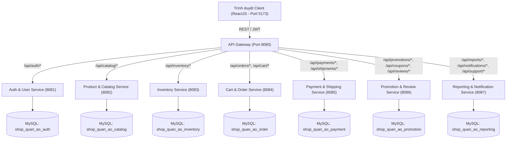
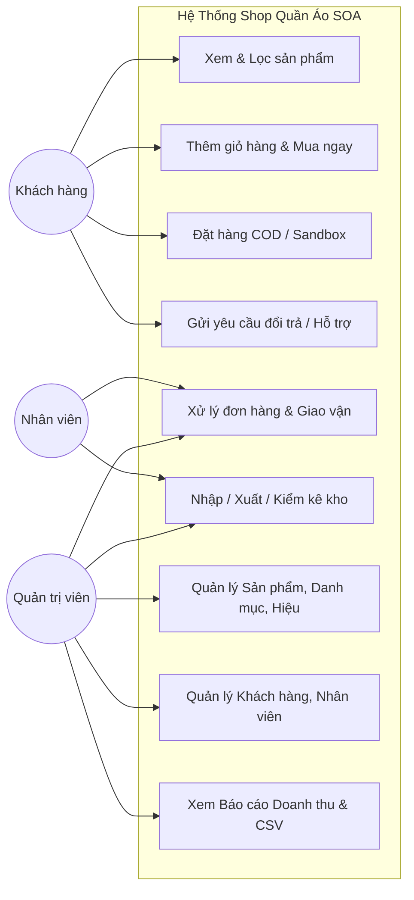
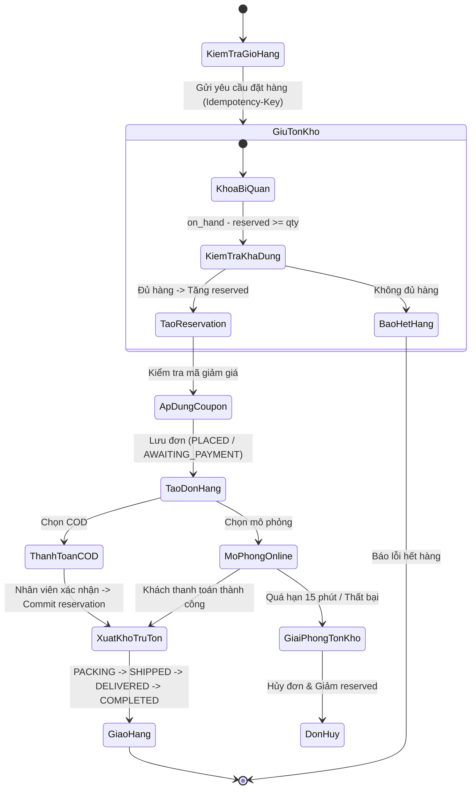
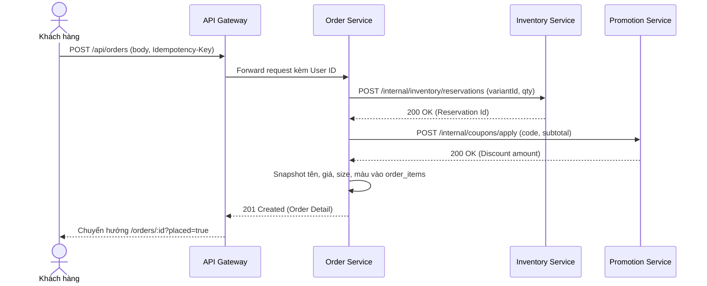

# BÁO CÁO ĐỒ ÁN HOÀN CHỈNH

**ĐỀ TÀI: THIẾT KẾ VÀ PHÁT TRIỂN HỆ THỐNG QUẢN LÝ SHOP QUẦN ÁO THEO KIẾN TRÚC HƯỚNG DỊCH VỤ (SOA)**

---

## CHƯƠNG 1: TỔNG QUAN ĐỀ TÀI

### 1.1. Lý do chọn đề tài
Trong kỷ nguyên số, ngành thương mại điện tử thời trang phát triển bùng nổ đòi hỏi hệ thống bán lẻ phải giải quyết cùng lúc hai bài toán: trải nghiệm mua sắm trực tuyến mượt mà cho khách hàng và vận hành kho - đơn hàng - giao vận chuẩn xác cho chủ cửa hàng. Đặc thù của ngành thời trang là sản phẩm có độ phân mảnh cao theo biến thể (kích cỡ, màu sắc, chất liệu), cùng với các nghiệp vụ khuyến mãi, giữ tồn kho theo thời gian thực và xử lý đổi trả phức tạp.

Kiến trúc nguyên khối (Monolithic) truyền thống bộc lộ nhiều điểm yếu: khó mở rộng, rủi ro lỗi lan truyền (một lỗi nhỏ ở phân hệ báo cáo có thể làm sập toàn bộ cổng thanh toán), và phụ thuộc vào một cơ sở dữ liệu duy nhất. Do đó, việc ứng dụng **Kiến trúc hướng dịch vụ (Service-Oriented Architecture - SOA)** với Spring Boot, ReactJS và MySQL là lựa chọn tối ưu nhằm phân tách hệ thống thành các dịch vụ độc lập về nghiệp vụ, chuẩn hóa giao tiếp thông qua hợp đồng REST API, nâng cao tính sẵn sàng và khả năng bảo trì.

### 1.2. Mục tiêu nghiên cứu
1. Xây dựng hệ thống bán hàng và quản trị shop quần áo trực tuyến hoạt động thực tế trên nền tảng Windows.
2. Áp dụng chuẩn mực kiến trúc SOA: 8 microservices nghiệp vụ độc lập, mỗi dịch vụ sở hữu cơ sở dữ liệu riêng biệt (`Database-per-Service`), không truy cập chéo schema SQL.
3. Đảm bảo tính toàn vẹn dữ liệu và giao dịch phân tán: cơ chế khóa bi quan (`Pessimistic Locking`), giữ tồn kho (`Reservation`), xử lý bù trừ đơn hàng (`Compensating Transactions`), và tính bất biến (`Idempotency`).
4. Xây dựng giao diện người dùng hiện đại bằng ReactJS (Vite) tách biệt giữa giao diện mua sắm (`StoreLayout`) và trang quản trị chuyên nghiệp (`AdminLayout`).

### 1.3. Phạm vi và đối tượng nghiên cứu
- **Đối tượng sử dụng:**
  - `CUSTOMER`: Người mua sắm trực tuyến (xem hàng, lọc sản phẩm, giỏ hàng, checkout COD/mô phỏng, theo dõi đơn, yêu cầu trả hàng, đánh giá, gửi yêu cầu hỗ trợ).
  - `STAFF`: Nhân viên cửa hàng (xem dashboard công việc, duyệt đơn, bàn giao vận chuyển, nhập/xuất/kiểm kê kho theo quyền được cấp).
  - `ADMIN`: Quản trị viên toàn quyền (quản lý sản phẩm, danh mục, thương hiệu, kho hàng, khách hàng, nhân viên & phân quyền, mã giảm giá, banner, nội dung, báo cáo doanh thu thuần & xuất CSV).
- **Phạm vi triển khai:** Hệ thống chạy thực tế trên môi trường máy tính cục bộ (Localhost Windows) với MySQL Server 8 (cổng 3310), API Gateway (cổng 8080) và 7 dịch vụ thành phần (8081-8087), Frontend cổng 5173.

---

## CHƯƠNG 2: CƠ SỞ LÝ THUYẾT

### 2.1. Tổng quan & Nguyên lý hoạt động của kiến trúc SOA
- **Nguyên lý phân định ranh giới (Service Boundary):** Mỗi dịch vụ phụ trách một miền nghiệp vụ duy nhất (Single Responsibility). Dữ liệu của dịch vụ nào thì dịch vụ đó độc quyền sở hữu (Encapsulation).
- **Hợp đồng công bố (Standardized Service Contract):** Các dịch vụ trao đổi thông qua RESTful HTTP API chuẩn với các định dạng JSON, status code HTTP rõ ràng (200, 201, 400, 401, 403, 404, 409, 503).
- **Tính tự chủ và khả năng tái sử dụng (Autonomy & Reusability):** Các dịch vụ có vòng đời phát triển, đóng gói (.jar) và triển khai độc lập.

### 2.2. REST API & Giao tiếp liên dịch vụ
Hệ thống sử dụng các mẫu thiết kế:
- **API Gateway Pattern:** Đóng vai trò là điểm tiếp nhận duy nhất cho client, thực hiện giải mã JWT, kiểm tra phiên, định tuyến yêu cầu, cấu hình CORS và ngăn ngừa lộ các endpoint nội bộ.
- **Idempotency Key Pattern:** Khách hàng gửi header `Idempotency-Key` (UUIDv4) cho các thao tác nhạy cảm (tạo đơn, thanh toán, đổi trả, ghi kho) nhằm chống thực thi trùng lặp khi mạng bị chập chờn.

### 2.3. Công nghệ Backend & Bảo mật
- **Java 17 & Spring Boot 3.5.x:** Nền tảng microservices hiện đại, quản lý cấu hình và dependency qua Maven đa module.
- **Spring Data JPA & Hibernate:** Ánh xạ thực thể ORM, thực thi truy vấn tham số hóa (Prepared Statements) chống tấn công SQL Injection.
- **Spring Security & JWT (JSON Web Token):** Mật khẩu người dùng được băm an toàn bằng thuật toán **BCrypt (cost factor 12)**. Token JWT mang chữ ký HMAC-SHA256, thời hạn 30 phút, đồng bộ với bảng phiên `auth_sessions` trong MySQL để cho phép thu hồi phiên tức thời khi người dùng đăng xuất hoặc bị khóa tài khoản.

### 2.4. Công nghệ Frontend & Cơ sở dữ liệu
- **React 18 + Vite:** Tối ưu hóa tốc độ tải và đóng gói bundle, định tuyến qua React Router DOM v6, gọi API qua thư viện Axios.
- **MySQL 8.x:** Hệ quản trị cơ sở dữ liệu quan hệ mạnh mẽ, hỗ trợ kiểu dữ liệu số thực chính xác `DECIMAL(15, 2)` cho nghiệp vụ tài chính, bảng mã `utf8mb4` hỗ trợ đầy đủ tiếng Việt có dấu.

---

## CHƯƠNG 3: PHÂN TÍCH VÀ THIẾT KẾ HỆ THỐNG

### 3.1. Sơ đồ Kiến trúc Tổng thể SOA

### 3.2. Sơ đồ Use Case Tổng quát

### 3.3. Sơ đồ Luồng Đặt hàng & Xử lý Tồn kho (Activity Diagram)

### 3.4. Sơ đồ Tuần tự Tạo Đơn Hàng (Sequence Diagram)

### 3.5. Thiết kế Cơ sở Dữ liệu (ERD các miền nghiệp vụ)
1. **Miền Auth (`shop_quan_ao_auth`):**
   - `users`: id (PK), email (UQ), full_name, phone, password_hash, active, inventory_write, marketing_consent, created_at.
   - `roles`: name (PK).
   - `user_roles`: user_id, role (FK -> users, roles).
   - `addresses`: id (PK), user_id (FK), recipient, phone, detail, default_address.
   - `auth_sessions`: id (PK), user_id (FK), token_hash, expires_at, revoked.
2. **Miền Catalog (`shop_quan_ao_catalog`):**
   - `categories`: id (PK), name (UQ), parent_id (FK tự thân), active.
   - `brands`: id (PK), name (UQ), active.
   - `products`: id (PK), code (UQ), name, description, material, style, gender, category_id, brand_id, active, featured, version.
   - `product_variants`: id (PK), product_id (FK), sku (UQ), size, color, cost_price, price, sale_price, active.
   - `product_images`: id (PK), product_id (FK), url, sort_order.
   - `banners`, `store_settings`: Quản lý nội dung và thông báo cửa hàng.
3. **Miền Inventory (`shop_quan_ao_inventory`):**
   - `inventory`: variant_id (PK), on_hand, reserved, available (on_hand - reserved), minimum_stock.
   - `inventory_transactions`: id (PK), variant_id, type, quantity_delta, reserved_delta, reason, actor_id, created_at.
   - `reservations`: order_id (PK), state (HELD, COMMITTED, RELEASED), expires_at.
   - `reservation_items`: id (PK), reservation_id (FK), variant_id, quantity.
4. **Miền Order (`shop_quan_ao_order`):**
   - `carts`, `cart_items`: Giỏ hàng theo người dùng.
   - `orders`: id (PK), user_id, recipient, phone, address, note, subtotal, shipping_fee, discount, total, state, payment_method, payment_state, shipping_state, category_id snapshot.
   - `order_items`: id (PK), order_id (FK), variant_id, product_name, sku, size, color, price, quantity.
   - `order_status_history`: id (PK), order_id (FK), state, note, created_at.
   - `return_requests`: id (PK), order_id (FK), user_id, state, reason, refund_amount.
5. **Miền Payment & Shipping (`shop_quan_ao_payment`):**
   - `payments`: order_id (PK), user_id, method, state, amount, reference.
   - `shipments`: order_id (PK), carrier, tracking, assignee, carrier_cost, shipping_fee, state.
   - `refunds`: id (PK), order_id (FK), amount, state, reason, reference.
6. **Miền Promotion & Review (`shop_quan_ao_promotion`):**
   - `coupons`, `coupon_usages`, `promotions`, `reviews`, `wishlists`.
7. **Miền Reporting (`shop_quan_ao_reporting`):**
   - `notifications`, `customer_support`, `support_messages`, `support_history`, `guest_contacts`.

---

## CHƯƠNG 4: XÂY DỰNG VÀ TRIỂN KHAI HỆ THỐNG

### 4.1. Môi trường triển khai
- Hệ điều hành: Microsoft Windows 10/11.
- Java Development Kit: OpenJDK 17+.
- Build Tool: Apache Maven 3.9.x.
- Node.js: v20.x, npm v10.x.
- Cơ sở dữ liệu: MySQL Community Server 8.0, cổng lắng nghe 3310.

### 4.2. Khởi chạy 1 cú nhấp chuột (One-Click Launchers)
Dự án đã được trang bị sẵn các script điều khiển tự động ngay tại thư mục gốc `nhom10`:
1. **`CHAY-HE-THONG.cmd`**:
   - Dọn dẹp tiến trình cũ nếu còn sót lại.
   - Khởi động lần lượt 8 microservices backend và tự động kiểm tra endpoint `/actuator/health` của từng service (`UP`).
   - Khởi động frontend React Vite tại cổng 5173.
   - Tự động mở trình duyệt web tới `http://localhost:5173`.
2. **`DUNG-HE-THONG.cmd`**: Dừng toàn bộ 8 tiến trình Java backend và frontend an toàn.

### 4.3. Kết quả Kiểm thử tự động (Verification Metrics)
- **Backend JUnit 5 / Spring Boot Test:**
  - `auth-user-service`: 14 tests PASS
  - `catalog-service`: 14 tests PASS
  - `inventory-service`: 10 tests PASS
  - `order-service`: 29 tests PASS
  - `payment-shipping-service`: 13 tests PASS
  - `promotion-review-service`: 12 tests PASS
  - `reporting-notification-service`: 19 tests PASS
  - **Tổng cộng: 111/111 bài test backend đạt `BUILD SUCCESS` (0 thất bại, 0 lỗi).**
- **Frontend Vitest (Testing Library):**
  - **44/44 bài test đạt `PASS` trên 14 bộ test suite.**
  - `npm run build` đóng gói production hoàn thành xuất sắc trong 2.31 giây (0 lỗi, 0 cảnh báo).

---

## CHƯƠNG 5: KẾT LUẬN VÀ HƯỚNG PHÁT TRIỂN

### 5.1. Kết quả đạt được
1. Hiện thực hóa đầy đủ 100% các chức năng được mô tả trong đề tài theo đúng chuẩn kiến trúc hướng dịch vụ SOA.
2. Triển khai 8 microservices độc lập với 7 cơ sở dữ liệu MySQL thật, giải quyết triệt để các bài toán giữ tồn kho, chống bán âm, idempotency và bù trừ giao dịch.
3. Giao diện người dùng tiếng Việt, định dạng tiền tệ VNĐ, trải nghiệm mua sắm hiện đại kết hợp bảng điều khiển quản trị Admin Sidebar trực quan.
4. Hệ thống kiểm thử tự động toàn diện đạt 155/155 test cases thành công và có tài liệu kỹ thuật chi tiết.

### 5.2. Hạn chế của hệ thống
- Hệ thống thanh toán trực tuyến hiện tại được thực thi ở chế độ mô phỏng Sandbox nội bộ, chưa kết nối trực tiếp cổng ngân hàng thật (VNPay/MoMo/ZaloPay).
- Chưa cấu hình phân tán trên cụm máy chủ đám mây (Cloud Kubernetes / Docker Swarm) mà đang chạy cục bộ trên môi trường máy đơn Windows.

### 5.3. Hướng phát triển trong tương lai
- Tích hợp cổng thanh toán thực tế thông qua Webhook đối soát tự động của VNPay hoặc PayOS.
- Bổ sung Message Broker (Apache Kafka hoặc RabbitMQ) để chuyển dịch sang kiến trúc hướng sự kiện (Event-Driven Architecture - EDA) giúp tăng thông lượng xử lý đơn hàng trong các đợt flash sale lớn.
- Đóng gói toàn bộ hệ thống bằng Docker Compose để triển khai đa nền tảng một cách dễ dàng.
