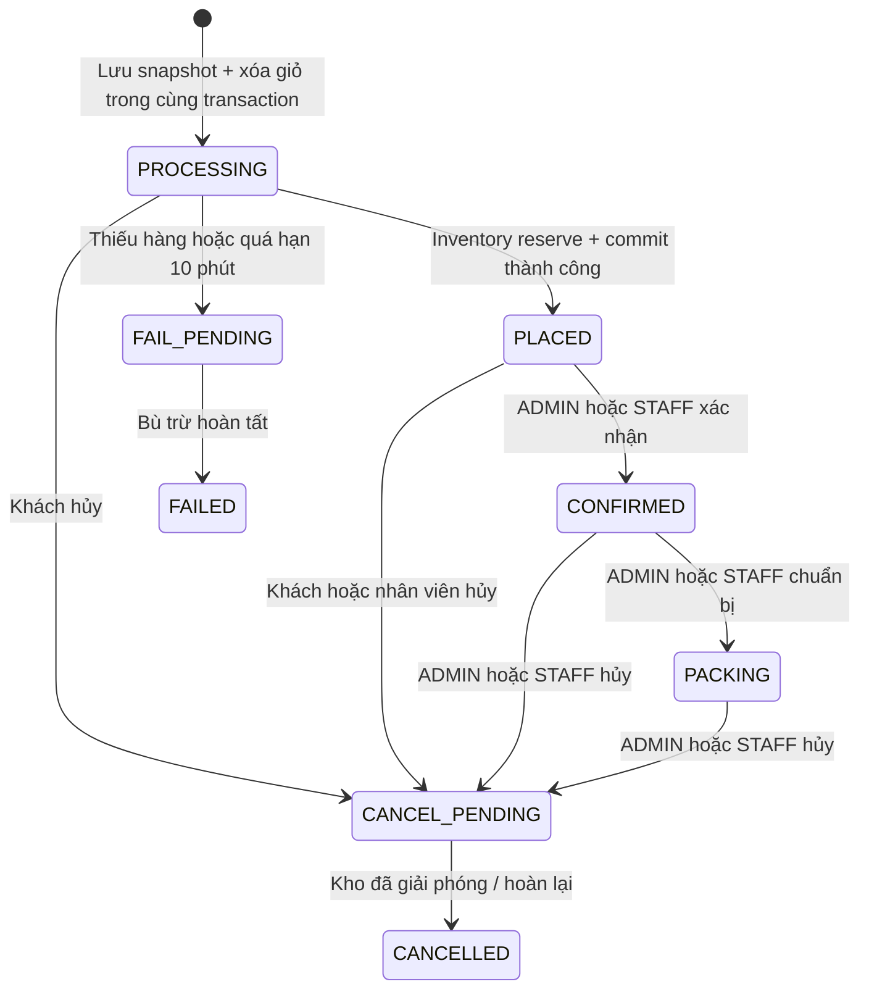
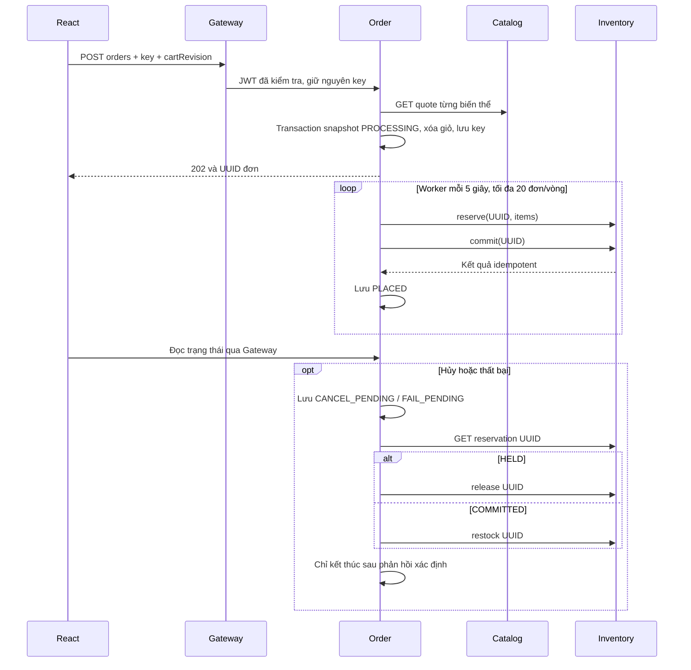
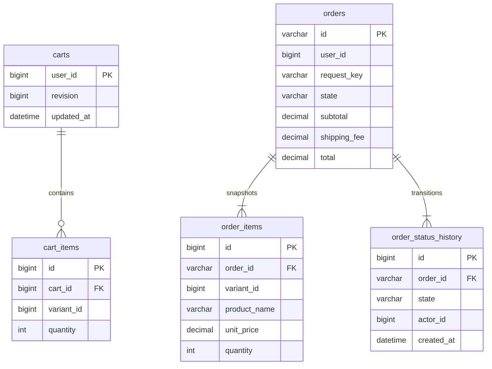

> Cập nhật phần 5: coupon và giá khuyến mãi đã tích hợp với Order. Các sơ đồ và trạng thái phần 3 bên dưới là lịch sử thiết kế; xem thêm [Promotion/Review](promotion-review.md) và [Payment/Shipping](payment-shipping.md).

# API Giỏ hàng và Đơn hàng — phần 3

Order Service: `127.0.0.1:8084`, database `shop_quan_ao_order`, qua Gateway `127.0.0.1:8080`. Swagger: http://localhost:8084/swagger-ui/index.html. Migration được Flyway chạy khi khởi động. Không đọc database Auth, Catalog hoặc Inventory.

## API thực tế

| Method | URL | Input | Output | Quyền |
|---|---|---|---|---|
| GET | /api/cart | Không | CartView | Đã đăng nhập, giỏ của mình |
| PUT | /api/cart/items/{variantId} | quantity: số nguyên 1..99 | CartView | Giỏ của mình |
| DELETE | /api/cart/items/{variantId} | ID biến thể | 204 | Giỏ của mình |
| DELETE | /api/cart | Không | 204 | Giỏ của mình |
| POST | /api/orders | Checkout + Idempotency-Key | 202 OrderView | Người đang đăng nhập |
| GET | /api/orders | page, state tùy chọn | PageResult<OrderView> | Đơn của mình |
| GET | /api/orders/manage | page, state, q, from, to tùy chọn | PageResult<OrderView> | ADMIN, STAFF |
| GET | /api/orders/{id} | UUID | OrderView | Chủ đơn hoặc ADMIN/STAFF |
| POST | /api/orders/{id}/state | state | OrderView | Kiểm tra chủ sở hữu và luồng chuyển |

PUT giỏ đặt **số lượng tuyệt đối**, gọi lại cùng nội dung không cộng thêm số lượng. Mỗi giỏ tối đa 20 biến thể. Giá hiển thị được lấy qua Catalog; dữ liệu lưu giỏ chỉ gồm variant ID, quantity. Không giữ kho khi lưu giỏ. Chưa có kiểm tra tồn ngay tại API giỏ; tồn được kiểm tra bắt buộc khi đặt đơn. UI ngăn chọn mua biến thể báo hết hàng.

Danh sách quản lý đơn lọc tại database theo trạng thái; `q` tối đa 120 ký tự, tìm không phân biệt hoa/thường theo mã đơn UUID hoặc tên người nhận, và tìm chuỗi trong số điện thoại người nhận. `from`/`to` dùng `yyyy-MM-dd`, bao gồm cả ngày cuối theo múi giờ `Asia/Ho_Chi_Minh`; ngày đầu sau ngày cuối trả 400. Kết quả phân trang 20 đơn, sắp xếp mới nhất trước rồi theo ID. Đây là tên và điện thoại *người nhận* được snapshot trong đơn, chưa tra theo hồ sơ tài khoản Auth qua service khác. API riêng của khách `/api/orders` vẫn chỉ trả đơn của chính mình và không nhận các bộ lọc quản lý.

`CartView`: revision, items[], subtotal, shippingFee, total. `Line`: variantId, productId, categoryId, sku, productName, size, color, quantity, unitPrice, active, imageUrl. Catalog cung cấp `imageUrl` của ảnh đầu tiên qua quote nội bộ; giỏ hiển thị ảnh này và dùng ảnh dự phòng nếu sản phẩm chưa có ảnh hoặc tệp bị lỗi. `imageUrl` của dòng đơn hàng lịch sử hiện là `null` vì Order chỉ lưu snapshot tên, SKU và giá tại lúc đặt, chưa lưu snapshot ảnh.

`Checkout`: cartRevision, recipient (1..120 ký tự), phone (9..20 ký tự số và +, khoảng trắng, dấu ngoặc/gạch), address (1..500), note (tối đa 500). Không nhận userId hoặc đơn giá từ client. API lấy danh tính từ JWT, kiểm tra revision và đọc lại giá hiệu lực/active từ Catalog. Phí tiêu chuẩn cố định 30.000 VNĐ. Đã hỗ trợ `couponCode` tùy chọn và `paymentMethod` là `COD` hoặc `SIMULATED`; coupon/giá chương trình được Order xác minh lại qua REST Promotion. Khách chưa được chọn hãng vận chuyển tại checkout.

`Idempotency-Key`: 8..100 ký tự chữ/số/_/-. Unique theo userId. Cùng key và Checkout trả đúng đơn cũ, kể cả đã xóa giỏ. Khác Checkout trả 409. Giỏ thay đổi hoặc rỗng trả 409. Không tự tạo key mới sau timeout; frontend giữ key, payload và bản hiển thị giỏ trong sessionStorage cho lần thử lại. Đăng xuất/đăng nhập xóa dữ liệu thử lại để không lẫn giữa tài khoản; người dùng có thể tra đơn đã tạo trong lịch sử của mình.

`OrderView`: id, userId, state, paymentMethod, paymentState, recipient, phone, address, note, subtotal, discount, couponCode, shippingFee, total, createdAt, items[], history[]. History gồm state, actorId, createdAt; actor 0 là tác vụ hệ thống. Giá/tên/SKU/size/màu được snapshot trong order_items. Thanh toán mô phỏng local có trạng thái tách riêng và không thu tiền thật; COD chỉ ghi đã thu sau tác vụ xác nhận. Không suy ra đã thanh toán từ việc đặt đơn.

## Trạng thái và bù trừ



Không có đường chuyển từ CANCELLED/FAILED sang PLACED hoặc CONFIRMED. Chưa có SHIPPED/DELIVERED/COMPLETED vì phải tích hợp Payment & Shipping ở phần sau. Khách chỉ hủy PROCESSING/PLACED.



POST kho không retry mù trong một HTTP call; timeout 2 giây. Worker đọc trạng thái bền vững từ Order và gọi lại bằng UUID đã lưu, Inventory đảm bảo idempotency. GET nội bộ có tối đa 2 lần khi lỗi I/O. Mất phản hồi commit giữ PROCESSING để đối soát; không tự coi là thất bại đã hoàn kho. Mất phản hồi khi bù trừ giữ trạng thái pending. Nếu worker chết sau remote success nhưng trước local commit, lần chạy sau đối soát bằng UUID cũ.

Khóa một dòng order_guard trong các thao tác ghi để tuần tự hóa cho bản local, tương tự Inventory. Worker cập nhật updatedAt mỗi lượt để các đơn chưa phục hồi không chiếm mãi 20 vị trí đầu. Khóa giữ cả khi gọi REST nên không phù hợp thông lượng lớn; chưa có distributed outbox, circuit breaker hoặc giới hạn tổng số lần bù trừ. Sau 10 phút PROCESSING chuyển bù trừ; nếu Inventory vẫn tắt, trạng thái pending được giữ và tiếp tục thử ở vòng sau. Lượt giữ kho chưa commit tự hết hạn ở Inventory sau 15 phút. Cần đối soát vận hành trong lỗi mạng kéo dài hoặc yêu cầu đến remote rất muộn; chưa chứng minh mọi kịch bản phân tán bằng fault-injection thực tế.

## Dữ liệu sở hữu



user_id, product_id, variant_id là tham chiếu liên service, không có FK xuyên schema. Unique key chống trùng đơn theo user/request_key và trùng variant trong giỏ/đơn. MySQL CHECK bảo vệ quantity, tiền và state. Dòng con thuộc vòng đời bản ghi cha; không có updated_at riêng cho cart_items/order_items/history trong bản này. Không xóa lịch sử đơn hoặc biến động kho khi chạy smoke test.

## File của module

```text
backend/order-service/
  pom.xml
  src/main/java/vn/shop/order/
    OrderApplication.java
    RemoteSessionVerifier.java
    Entities.java
    Repositories.java
    OrderDtos.java
    OrderRemote.java
    OrderService.java
    OrderSaga.java
    OrderWorker.java
    OrderController.java
  src/main/resources/
    application.yml
    db/migration/V1__orders.sql
  src/test/java/vn/shop/order/OrderIntegrationTest.java
  src/test/resources/application-test.yml
frontend/src/OrderPages.jsx
frontend/src/OrderPages.test.jsx
scripts/Smoke-Orders.ps1
```

Entities.java chứa các entity của riêng Order; Repositories.java chứa ba Spring Data repository. Service nghiệp vụ, controller và DTO tách file; lỗi HTTP dùng Errors/ApiException chung. App.jsx nối route, CatalogPages.jsx dùng AddToCart. Không cần sửa tên schema/cổng của các module trước.
