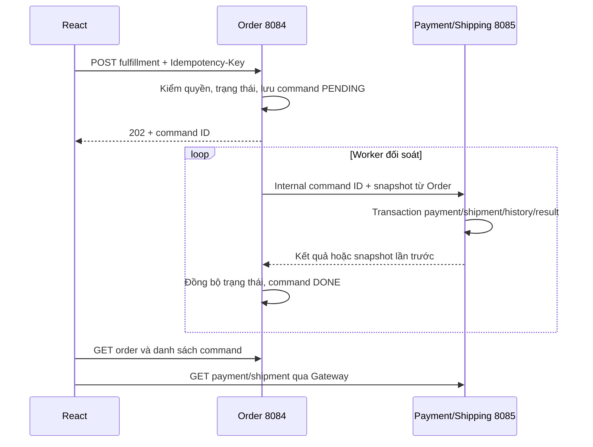
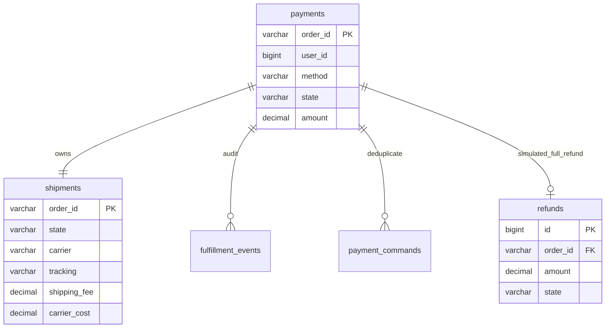

# Payment & Shipping — phần 4

Service độc lập: **8085**, schema **shop_quan_ao_payment**. Swagger: http://localhost:8085/swagger-ui/index.html. Gateway tiếp tục ở 8080; không đổi cổng/schema của phần trước. Service sở hữu payments, shipments, refunds, fulfillment_events, payment_commands và payment_guard. Mọi tiền tệ là DECIMAL(19,2)/BigDecimal.

## API và ranh giới

| Method | Endpoint qua Gateway | Input | Output | Quyền |
|---|---|---|---|---|
| POST | /api/orders | Checkout thêm paymentMethod=COD hoặc SIMULATED | 202 OrderView | Chủ giỏ; bỏ phương thức mặc định COD |
| GET | /api/payments/{orderId} | UUID đơn | FulfillmentView | Chủ đơn hoặc ADMIN/STAFF |
| GET | /api/shipments/{orderId} | UUID đơn | FulfillmentView | Chủ đơn hoặc ADMIN/STAFF |
| POST | /api/orders/{orderId}/fulfillment | FulfillmentInput + Idempotency-Key | 202 CommandView | Theo action và trạng thái |
| GET | /api/orders/{orderId}/fulfillment | UUID đơn | Tối đa 20 CommandView mới nhất | Chủ đơn hoặc ADMIN/STAFF |

Order điều phối ghi thanh toán/vận chuyển để khóa đồng thời các thao tác xung đột như giao hàng và hủy đơn. Payment/Shipping thực thi nghiệp vụ trong transaction riêng và lưu kết quả idempotent. Các endpoint đọc đi thẳng đến Payment/Shipping. Không có ghi chéo database, không có REST vòng ngược Payment → Order trong transaction.

Endpoint riêng **không qua Gateway**: `POST http://localhost:8085/internal/fulfillment/{orderId}/commands/{commandId}`, yêu cầu `X-Internal-Key`. Command gồm userId, method, amount, shippingFee, recipient, phone, address, action, actorId và các trường FulfillmentInput. Ngữ cảnh này do Order lấy từ database, không nhận số tiền/chủ sở hữu do trình duyệt gửi. Endpoint này chỉ dành cho service tin cậy giữ khóa nội bộ, không phải callback công khai của ngân hàng.

`FulfillmentInput`: action; carrier, tracking, assignee (tối đa 120 ký tự); reference (190); carrierCost (không âm, tối đa 2 chữ số thập phân); note (500). Các trường không dùng có thể bỏ qua.

`CommandView`: id, action, state=PENDING/DONE/REJECTED, failure, createdAt. HTTP 202 chỉ nghĩa là đã lưu yêu cầu, **không phải đã thu tiền/giao hàng**. Frontend hiển thị trạng thái xử lý và đọc lại đơn mỗi 5 giây.

`FulfillmentView`: orderId, userId, method, paymentState, amount, reference, shippingState, recipient, phone, address, carrier, tracking, assignee, shippingFee, carrierCost, updatedAt, history[], refunds[]. Khách không được trả carrierCost hoặc assignee. history có action, actorId, note, createdAt. refunds có amount, state, reason, createdAt.

OrderView bổ sung paymentMethod, paymentState, shippingState và pendingCommandId. Đây là bản sao trạng thái được đồng bộ sau phản hồi Payment; Payment/Shipping vẫn là nguồn dữ liệu nghiệp vụ gốc. Không thể suy ra thanh toán thật từ COMPLETED: đơn mô phỏng hoàn tất vẫn có paymentState=SIMULATED_PAID.

## Các thao tác

| Action | Trạng thái Order đầu vào | Điều kiện/quyền | Kết quả Order |
|---|---|---|---|
| SIM_SUCCESS | AWAITING_PAYMENT | Chỉ chủ đơn; method SIMULATED; chưa quá 15 phút từ tạo đơn | PLACED, payment SIMULATED_PAID |
| SIM_FAILURE | AWAITING_PAYMENT | Như trên | FAIL_PENDING → FAILED sau bù trừ |
| SHIP | PACKING | ADMIN/STAFF; bắt buộc carrier, tracking, assignee, carrierCost | SHIPPED |
| DELIVER | SHIPPED | ADMIN/STAFF | COD: DELIVERED; mô phỏng đã trả: COMPLETED |
| DELIVERY_FAIL | SHIPPED | ADMIN/STAFF, bắt buộc note | DELIVERY_FAILED |
| RETRY_SHIP | DELIVERY_FAILED | ADMIN/STAFF | SHIPPED, giữ mã vận đơn |
| RETURN_RECEIVED | DELIVERY_FAILED | ADMIN/STAFF; note xác nhận hàng thực tế đã về | CANCEL_PENDING → CANCELLED sau hoàn kho |
| COLLECT_COD | DELIVERED | ADMIN/STAFF; method COD; reference chứng từ bắt buộc | COMPLETED, payment PAID |

Không có nút tự tạo thanh toán thật. COLLECT_COD chỉ ghi nhận thủ công rằng nhân viên đã thu **đủ toàn bộ** số tiền đơn. Không có thu từng phần. Phí khách trả giữ nguyên snapshot 30.000 VNĐ; carrierCost là chi phí trả hãng, ghi riêng và không làm thay đổi tổng tiền khách đã chấp nhận. Unique(carrier, tracking) ngăn mã vận đơn cùng hãng dùng cho hai đơn.

Mã SHIP hoặc COLLECT_COD thiếu thông tin nghiệp vụ có thể được lưu PENDING rồi chuyển REJECTED với lý do. Người dùng sửa và gửi key mới. Sai vai trò/trạng thái tại Order bị chặn ngay 403/409. Không thể hủy đơn khi đang đối soát một command. Các trạng thái SHIPPED, DELIVERED, DELIVERY_FAILED, COMPLETED không đi qua API chuyển trạng thái thủ công của phần 3.

## Local simulation

Tại checkout chọn **Mô phỏng local — không thu tiền thật**. Khi worker chốt kho, đơn chuyển AWAITING_PAYMENT. Chủ đơn chọn kết quả thành công/thất bại ngay trên chi tiết đơn. Không có khóa API bên thứ ba, không gọi ngân hàng, không có thẻ hoặc tài khoản thanh toán thật.

- SIMULATED_PAID: mô phỏng thành công, tuyệt đối không đổi thành PAID.
- SIMULATED_FAILED: mô phỏng thất bại; Order bù trừ kho rồi FAILED.
- SIMULATED_REFUNDED: hoàn mô phỏng toàn bộ; ghi một refunds duy nhất cho đơn, không chuyển tiền.
- Nếu không chọn kết quả trong 15 phút, worker đưa đơn sang FAIL_PENDING và bù trừ.
- Hủy đơn mô phỏng đã trả trước khi giao hoặc nhận lại hàng giao thất bại tự ghi hoàn mô phỏng đúng một lần.

Đây là **simulation local**, không phải sandbox chính thức VNPay/MoMo. Chưa có tích hợp ngân hàng hoặc hãng giao hàng bên ngoài. Khi bổ sung cổng thật cần kiểm chữ ký callback, đối soát amount/currency/order, kiểm nguồn thông báo theo tài liệu nhà cung cấp và lưu mã giao dịch unique; không dùng nút mô phỏng để đánh dấu giao dịch thật.

## Bền vững, timeout và giới hạn

Order lưu fulfillment_commands (payload, actor, key, hash, trạng thái) và pending_command_id trong cùng transaction, rồi worker mới gọi Payment. Nếu request hoặc response mất, bản ghi vẫn còn. Worker dùng UUID command cũ; Payment lưu payment_commands cùng các biến động trong một transaction. Cùng command ID và payload trả snapshot kết quả cũ; khác payload trả 409. Command hash bao gồm actor tại Order. Hủy mô phỏng lặp dùng unique refund theo orderId.

Timeout REST 2 giây, không retry POST ngay trong một HTTP call. Worker thử lại ở vòng 5 giây khi chưa xác định kết quả. Chỉ 409 rõ ràng đánh dấu REJECTED; lỗi kết nối giữ PENDING và khóa thao tác xung đột. Một dòng guard tuần tự hóa ghi ở mỗi service, phù hợp demo local; không tuyên bố thông lượng cao. Payment không gọi ngược Order khi đang giữ khóa nên không tạo vòng chờ khóa REST.

Khi hủy/thất bại, Order giải phóng hoặc restock Inventory trước, sau đó xác nhận hủy/hoàn mô phỏng với Payment. Nếu Payment tắt thì đơn vẫn pending dù kho có thể đã hoàn; lần sau Inventory xử lý idempotent. Không đánh dấu CANCELLED chỉ vì request bị timeout. Giữ kho chưa commit vẫn có hạn 15 phút ở Inventory. Chưa có circuit breaker, backoff tăng dần hoặc hàng đợi dead-letter; lỗi kéo dài cần kiểm tra log và các command PENDING.

Đơn cũ được migration gán COD/UNPAID/NEW, không giả tạo lịch sử thanh toán. Hồ sơ Payment của đơn cũ được khởi tạo khi thao tác hợp lệ tiếp theo; đơn cũ đã kết thúc có thể trả 404 hồ sơ Payment, UI giải thích chưa có hồ sơ.

Chưa có trả hàng sau COMPLETED, hoàn COD thật, hoàn một phần, sửa vận đơn sau SHIP, phân công theo tài khoản nhân viên (assignee hiện là tên ghi nhận), hoặc danh sách vận đơn riêng. Quản lý giao hàng nằm trong trang xử lý đơn và chi tiết đơn. Báo cáo doanh thu tương lai phải loại toàn bộ phương thức SIMULATED khỏi tiền thực.

## Sơ đồ giao tiếp





order_id của payments là ID tham chiếu bên ngoài, không FK sang schema Order. FK giữa các bảng Payment ở cùng schema. Tệp migration mới không sửa checksum V1 của Order; V2 mở rộng trạng thái và thêm command bền vững.

## File chính

```text
backend/payment-shipping-service/
  pom.xml
  src/main/java/vn/shop/payment/
    PaymentApplication.java
    RemoteSessionVerifier.java
    PaymentDtos.java
    PaymentEntities.java
    PaymentRepositories.java
    PaymentService.java
    PaymentController.java
  src/main/resources/application.yml
  src/main/resources/db/migration/V1__payment_shipping.sql
  src/test/java/vn/shop/payment/PaymentIntegrationTest.java
  src/test/resources/application-test.yml
backend/order-service/src/main/java/vn/shop/order/PaymentBridge.java
backend/order-service/src/main/java/vn/shop/order/FulfillmentService.java
backend/order-service/src/main/resources/db/migration/V2__fulfillment.sql
frontend/src/FulfillmentPanel.jsx
frontend/src/FulfillmentPanel.test.jsx
scripts/Smoke-PaymentShipping.ps1
```

Order entity/repository/DTO/service/controller/saga hiện có và OrderPages/App được cập nhật để nối luồng. Danh sách mọi file nằm tại docs/file-manifest.txt.
