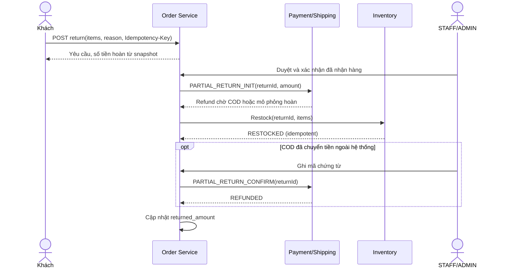

# Phần 10 — trả hàng một phần sau khi đơn hoàn tất

## Mục tiêu và ranh giới

Khách hàng có thể chọn số lượng từng biến thể trong một đơn đã hoàn tất để trả một phần. Mỗi đơn hiện cho phép đúng một yêu cầu trả (toàn bộ hoặc một phần), trong 14 ngày kể từ lúc hoàn tất. Hệ thống chưa hỗ trợ đổi sản phẩm hoặc tạo yêu cầu trả thứ hai sau khi yêu cầu đầu được xử lý.

## Thiết kế SOA và dữ liệu

Order Service sở hữu `return_requests`, `return_items`, số tiền đã hoàn trên `orders.returned_amount` và giá mua snapshot của `order_items`. Inventory Service sở hữu `partial_return_restocks` có return ID duy nhất; Payment/Shipping Service sở hữu `refunds` và `payment_commands`. Không service nào truy cập bảng của service khác. Order gọi REST nội bộ để lập refund và hoàn tồn, dùng mã lệnh cố định để thử lại sau timeout.

Tiền hoàn một phần bằng tổng `unit_price × quantity` các dòng trả, trừ phần `order.discount` phân bổ theo tỷ lệ tổng giá dòng trả trên `order.subtotal`, làm tròn hai chữ số thập phân. Phí vận chuyển không hoàn trong trường hợp này. Số tiền và danh sách biến thể được lưu khi tạo yêu cầu; sửa giá sản phẩm sau đó không thay đổi khoản hoàn.

Sau khi cửa hàng duyệt và xác nhận nhận hàng, Payment tạo refund một phần. Inventory tăng `on_hand` cho đúng các biến thể/số lượng đã nhận, ghi giao dịch với operation key theo return ID. COD chỉ trừ `returned_amount` và ghi refund `REFUNDED` khi ADMIN đã chuyển tiền ngoài hệ thống và nhập chứng từ. Với mô phỏng, refund được ghi `SIMULATED_REFUNDED`, không có chuyển khoản thật. Đơn vẫn `COMPLETED`; thanh toán và vận chuyển của phần hàng giữ lại vẫn `PAID`/`SIMULATED_PAID` và `DELIVERED`.

Báo cáo dùng `total - returned_amount` cho doanh thu thuần đơn hoàn tất, tách COD và mô phỏng. Số lượng sản phẩm bán chạy trừ số đã trả. Báo cáo kỳ hiện quy về ngày hoàn tất đơn và hiển thị giá trị thuần tại thời điểm xem; chưa có báo cáo dòng tiền theo ngày thực hoàn.

## Triển khai và kiểm thử

Order Flyway V5 thêm `return_items`, mode, refund amount và returned amount; Inventory Flyway V2 thêm bảng chống hoàn lặp. Frontend cho phép chọn “Toàn bộ đơn” hoặc “Một phần đơn”, nhập số lượng từng biến thể, xem số tiền hoàn được backend xác định và theo dõi trạng thái. ADMIN/STAFF dùng hàng đợi trả hàng hiện có.

`mvn clean verify` đạt 97/97 bài JUnit; Vitest 28/28 và Vite production build thành công. [Smoke trả một phần](partial-returns-smoke-result.json) chạy 27 kiểm tra qua Gateway/MySQL 3310, gồm phân quyền, idempotency, hoàn kho đúng một đơn vị, khoản refund duy nhất và doanh thu giảm đúng tiền hoàn. [Smoke trả toàn bộ](returns-smoke-result.json) được chạy lại để kiểm tra hồi quy. Chứng từ `REFUND-*` trong smoke là dữ liệu demo, không chứng minh chuyển khoản ngân hàng.
