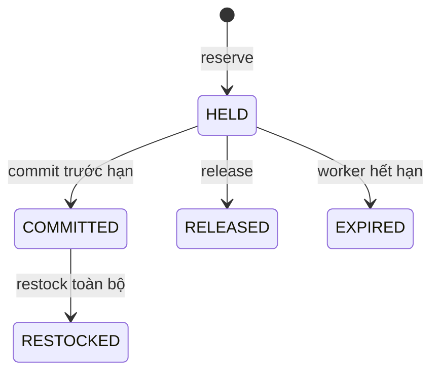
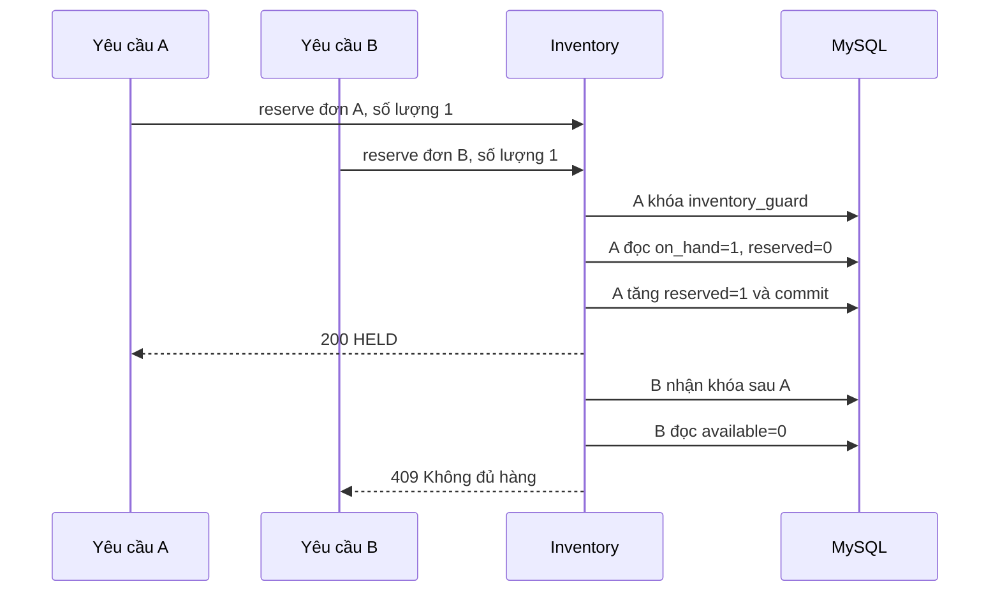

# Báo cáo cập nhật — phần 2: Catalog và Inventory

Tài liệu này cập nhật hiện trạng ngày 24/09/2026 và thay thế các nhận xét “chưa triển khai sản phẩm/kho” trong báo cáo phần 1. Phạm vi hiện có: Auth/User, Gateway, Catalog, Inventory và giao diện tương ứng. Hệ thống chưa có đặt hàng hoặc thanh toán.

## CHƯƠNG 1. TỔNG QUAN ĐỀ TÀI

Shop quần áo quản lý sản phẩm theo kích thước và màu sắc; cùng một sản phẩm có nhiều SKU và số lượng tồn khác nhau. Tách danh mục và kho giúp Catalog sở hữu thông tin mô tả/giá, trong khi Inventory bảo vệ bất biến số lượng. Phần 2 mở rộng nền tảng xác thực của phần 1 bằng hai dịch vụ này, đồng thời kiểm tra khả năng giao tiếp REST qua Gateway với MySQL thật.

Mục tiêu đã thực hiện gồm quản lý sản phẩm, danh mục cha/con, thương hiệu, biến thể, ảnh; tìm/lọc và tra cứu công khai; nhập/xuất/kiểm kê; lịch sử kho và cảnh báo mức tối thiểu; giao thức giữ kho phục vụ Order tương lai. Không đưa chức năng mua hàng chưa có backend vào giao diện.

## CHƯƠNG 2. CƠ SỞ LÝ THUYẾT

### 2.1. Quyền sở hữu dữ liệu

Catalog và Inventory là hai tiến trình Spring Boot khác nhau, kết nối hai schema MySQL riêng. Inventory lưu variant_id nhưng không tạo FK hoặc JOIN đến database Catalog. Khi ghi kho thủ công, service xác minh biến thể bằng REST. Trong phạm vi mỗi service, migration tạo FK, unique và check constraint.

### 2.2. Giao dịch, khóa và idempotency

Khóa bi quan kiểm soát quyền ghi dữ liệu trước khi kiểm tra tồn. Bản local dùng một dòng inventory_guard để tuần tự hóa toàn bộ giao dịch ghi; đây là lựa chọn ưu tiên tính rõ ràng và dễ kiểm thử, có giới hạn thông lượng. Idempotency-Key cùng payload trả kết quả đã ghi; cùng key với payload khác trả 409. Mỗi reservation gắn một order ID và trạng thái, nên commit/release/restock lặp không thay đổi kho thêm lần nữa.

Optimistic version trên Product ngăn quản trị viên ghi đè thông tin từ biểu mẫu cũ. Tên/giá khi bán sẽ được Order snapshot ở phần tiếp theo; hiện chưa có order_items.

### 2.3. Kiểm tra tệp

Upload không chỉ tin extension hoặc Content-Type. ImageIO đọc định dạng và kích thước, giải mã rồi mã hóa lại PNG, tên lưu do server sinh. Hệ thống giới hạn dung lượng, số điểm ảnh và số ảnh/sản phẩm. Metadata ở MySQL, tệp nằm trong uploads/catalog. Gateway chuyển tiếp nguyên vẹn multipart, không phân tích trước body.

## CHƯƠNG 3. PHÂN TÍCH VÀ THIẾT KẾ

### 3.1. Vai trò

Khách công khai xem sản phẩm đang bán, lọc, xem chi tiết và tồn khả dụng. ADMIN quản lý sản phẩm, giá vốn, biến thể, album ảnh, danh mục và thương hiệu. STAFF không sửa Catalog, có thể tra cứu kho; chỉ STAFF có inventoryWrite mới được nhập/xuất/kiểm kê. Backend kiểm tra vai trò và quyền, kể cả gọi URL trực tiếp.

### 3.2. Schema đã hiện thực

Catalog: categories, brands, products, product_variants, product_images. SKU unique toàn hệ thống Catalog; tổ hợp product_id/size/color unique. Sản phẩm chứa category_id, brand_id và version. Không xóa biến thể cũ để giữ tham chiếu kho.

Inventory: inventory_guard, inventory, inventory_transactions, reservations, reservation_items. Inventory dùng variant_id làm PK. Reservations dùng order_id làm PK. Reservation items có FK đến reservation và inventory. Transaction ghi delta tồn, delta giữ, lý do, người thực hiện, operation key và snapshot kết quả. Ràng buộc MySQL yêu cầu on_hand>=reserved>=0.

Một số bảng Catalog như danh mục/biến thể hiện chưa có created_at/updated_at riêng; Product có hai trường thời gian và Image có created_at. Đây là phần cần bổ sung migration khi hoàn thiện yêu cầu audit đầy đủ, không tự nhận đã đáp ứng toàn bộ từ điển dữ liệu đích.

### 3.3. Giao thức giữ kho

API và DTO đầy đủ tại `api/catalog-inventory.md`. Expiry là 15 phút, worker chạy mỗi 30 giây. API nội bộ yêu cầu khóa riêng và không công khai qua Gateway. Order saga chưa được xây dựng nên các API giữ kho hiện được kiểm thử trực tiếp bởi test client nội bộ.

## CHƯƠNG 4. XÂY DỰNG, TRIỂN KHAI VÀ KIỂM THỬ

### 4.1. Cấu trúc và khởi chạy

Hai module nằm tại backend/catalog-service và backend/inventory-service, mỗi module có controller/service/repository/DTO/entity, cấu hình, migration, seed và tests. Cổng lần lượt 8082/8083. Start-Local chạy Auth → Catalog → Inventory → Gateway. Catalog local seed 6 sản phẩm/48 biến thể; Inventory lấy dữ liệu Catalog qua REST và nhập 30 đơn vị mỗi biến thể mẫu khi kho rỗng.

Frontend bổ sung CatalogPages.jsx và catalog.css. Khách có bộ sưu tập, bộ lọc, chi tiết, chọn biến thể và sản phẩm cùng danh mục. Admin có thêm/sửa/ngừng sản phẩm, album ảnh có xem trước, danh mục/thương hiệu. Trang kho có phân trang, lọc biến thể, cảnh báo, biểu mẫu nhập/xuất/kiểm kê và lịch sử. Khi Inventory lỗi, UI báo chưa xác định được tồn thay vì giả thành hết hàng.

### 4.2. Kết quả có bằng chứng

- Backend: 29 test đạt, gồm Auth 11, Gateway 2, Catalog 8, Inventory 8. Catalog/Inventory dùng Spring Boot Test, MockMvc, H2 và Mockito để giả lập xác minh phiên từ Auth.
- Frontend: 8 test Vitest/Testing Library đạt, production build thành công. Test UI có mock REST, không thay thế kiểm thử MySQL.
- Smoke MySQL: 36 kiểm tra Catalog/Inventory và 23 kiểm tra Auth qua HTTP đạt. Kịch bản giữ kho gửi hai HTTP request song song vào MySQL có tồn 1; nhận 200 và 409. Các lần retry nhập/commit/release/restock bảo toàn số lượng. Có upload/read ảnh thật, phân quyền STAFF, version conflict và ngừng bán.
- Trình duyệt đã kiểm tra danh mục, chọn biến thể, giá VNĐ và tồn kho thật; ở màn hình 390×844 đã sửa tràn ngang và xác nhận scrollWidth bằng clientWidth.

Lần kiểm thử đầu phát hiện lỗi proxy multipart; đã sửa và chạy lại toàn bộ smoke. Báo cáo máy đọc ở docs/catalog-inventory-smoke-result.json và docs/auth-smoke-result.json. Runtime hiện có JDK25, biên dịch release17; chưa kiểm thử trực tiếp runtime JDK17. Không ghi kết quả này thành kiểm thử toàn bộ hệ thống bán hàng.

## CHƯƠNG 5. KẾT LUẬN VÀ HƯỚNG PHÁT TRIỂN

Đã tích hợp Auth, Gateway, Catalog và Inventory trên Windows/MySQL3310. Phần sản phẩm và kho có giao diện, dữ liệu thật, phân quyền backend và kiểm thử quan trọng. Cơ chế giữ kho có idempotency, timeout đọc Catalog và giải phóng hết hạn, làm nền tảng cho Order.

Hạn chế: chưa có Cart/Order, Payment/Shipping, Promotion/Review hoặc Reporting/Notification. Chưa có ảnh seed, banner, xếp hạng bán chạy, hoàn hàng một phần, audit riêng cho sửa Catalog hoặc kiểm thử tải lớn. Ghi kho dùng khóa toàn miền nên chưa tối ưu thông lượng. Giao diện kho hiện tra cứu bằng ID biến thể; chưa có tìm kiếm kho theo tên/SKU trực tiếp.

Phần tiếp theo là Cart & Order: giỏ có chủ sở hữu, snapshot giá từ Quote, idempotency tạo đơn, saga bền vững điều phối reserve/commit/release, trạng thái đơn và lịch sử. Chỉ sau đó triển khai thanh toán/vận chuyển và các nghiệp vụ bổ sung, giữ nguyên cổng/schema đã công bố.
