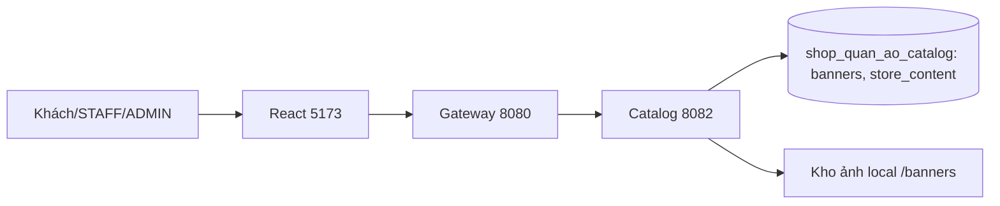
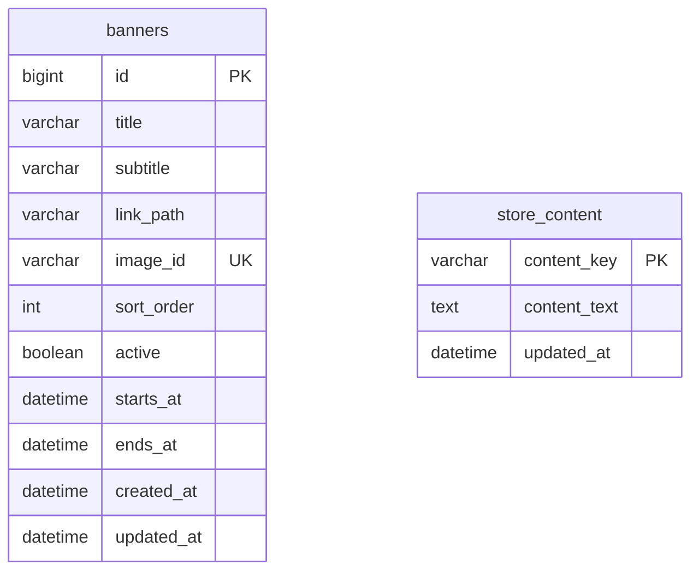

# Phần 8 — banner và nội dung cửa hàng

Ngày kiểm tra: 24/09/2026. Catalog Service (8082) thêm Flyway V2 trong `shop_quan_ao_catalog`. `banners` lưu tiêu đề, mô tả, link nội bộ, thứ tự, trạng thái, thời hạn và ID ảnh; `store_content` lưu sáu khóa nội dung cùng thời điểm sửa. Không có khóa ngoại sang schema khác. Ảnh lưu dưới `app.upload-dir/banners` với UUID, đường dẫn được lưu trong Catalog; MySQL không chứa dữ liệu ảnh.

ADMIN có hai trang quản lý tại `/admin/banners` và `/admin/store-content`. Quản lý banner cho xem trước ảnh, upload, sửa, gỡ ảnh và tắt hiển thị; mọi thao tác ghi kiểm tra vai trò tại Spring Security. Trang chủ chỉ hiển thị banner `active=true` trong khoảng thời gian hiệu lực. Nội dung giới thiệu, liên hệ và chính sách được đọc công khai; nếu chưa nhập, giao diện báo đang cập nhật. Thông báo chỉ xuất hiện khi ADMIN đã lưu văn bản. React không diễn giải HTML trong nội dung nhập.

Ảnh chỉ nhận JPEG/PNG đúng nội dung, tối đa 5 MB và 6 triệu pixel, được tái mã hóa PNG trước khi lưu. Tên file là UUID; API đọc ảnh kiểm tra bản ghi tham chiếu. Link banner chỉ nhận `/` hoặc `/products/{id}` để tránh điều hướng ra ngoài. Cập nhật banner không xóa cứng; thay ảnh/xóa ảnh dọn file cũ sau khi giao dịch database thành công.

Kiểm thử: thêm bốn bài JUnit/Spring Boot Test cho quyền truy cập, khoảng hiệu lực, validation, upload/đọc/xóa ảnh và nội dung. Toàn backend `mvn clean verify` đạt **84/84**; Vitest đạt **24/24**, Vite build production thành công. `Smoke-StoreContent.ps1` đạt **18/18** qua Gateway đến MySQL 3310, gồm ảnh PNG thật, chặn STAFF, ảnh giả, link ngoài và lưu/đọc nội dung. Bằng chứng ở `docs/store-content-smoke-result.json`. JUnit dùng H2; smoke dùng MySQL thật.

Giới hạn: chưa có trình soạn thảo nội dung giàu định dạng, lịch sử phiên bản nội dung, CDN lưu ảnh, kiểm tra sản phẩm link còn đang bán hoặc biểu mẫu liên hệ công khai cho khách chưa đăng nhập. Trang liên hệ hiện hiển thị nội dung ADMIN nhập và dẫn khách đã đăng nhập tới ticket hỗ trợ. Chưa triển khai quy trình trả hàng sau khi đơn hoàn tất.
