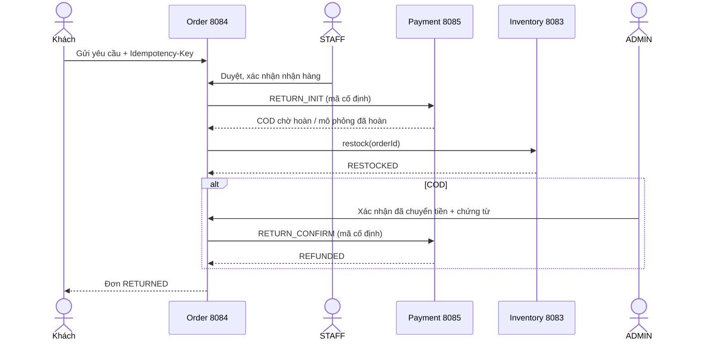

# Phần 9 — trả hàng sau hoàn tất

Ngày kiểm tra: 24/09/2026. Đã bổ sung quy trình **trả toàn bộ đơn** trong 14 ngày sau `COMPLETED`. Khách là chủ đơn gửi lý do, STAFF/ADMIN duyệt hoặc từ chối, nhận hàng thực tế. Order Service lưu yêu cầu và lịch sử; Payment/Shipping lưu refund; Inventory hoàn tồn qua REST idempotent. Schema Order dùng Flyway V4, Payment/Shipping dùng Flyway V2. Mọi bảng chỉ tham chiếu FK trong database do service sở hữu.

Một đơn chỉ có một yêu cầu trả hàng; cùng key và lý do trả kết quả cũ, khác key/lý do trả 409. Worker có thể thử lại sau timeout. Payment có guard và `payment_commands`; refund có `order_id UNIQUE`. Inventory dùng reservation order ID để chỉ hoàn một lần. Nếu Payment hoặc Inventory không phản hồi, yêu cầu giữ trạng thái đang đối soát và hiển thị lỗi gần nhất; không báo thành công sớm.

COD chỉ tạo `PENDING_MANUAL` sau khi nhận hàng, đơn vẫn `COMPLETED/PAID` cho tới khi ADMIN xác nhận chứng từ hoàn tiền thực tế. Sau đó Payment là `REFUNDED` và Order là `RETURNED`, báo cáo doanh thu loại đơn này. Giao dịch `SIMULATED` chuyển thành `SIMULATED_REFUNDED` và ghi rõ không có chuyển tiền thật. Phí giao hàng được hoàn cùng tổng đơn trong phạm vi trả toàn bộ.

Khi khách mở thông báo, Reporting & Notification lấy lịch sử Order qua REST và tạo thông báo `RETURNED` một lần cho chủ đơn. Các bước duyệt/nhận hàng hiện theo dõi trên chi tiết đơn, chưa tạo thông báo riêng.

Đã thêm bài kiểm thử JUnit cho chủ sở hữu, idempotency, giới hạn thời gian, phân quyền, hàng đợi xử lý, hai phương thức thanh toán, thử lại sau timeout và chống hoàn lặp. Frontend có panel trả hàng ở chi tiết đơn và hàng đợi `/manage/returns` cho STAFF/ADMIN. Toàn backend `mvn clean verify` đạt **93/93** JUnit; frontend Vitest **27/27** và Vite build production thành công. `Smoke-Returns.ps1` đạt **54/54** kiểm tra qua Gateway/MySQL, gồm đối chiếu doanh thu giảm đúng tổng đơn COD sau xác nhận hoàn, hàng đợi STAFF và thông báo RETURNED. Bằng chứng ở `docs/returns-smoke-result.json`.

Giới hạn: chưa trả một phần hoặc đổi sang sản phẩm khác; chưa tích hợp ngân hàng để tự chuyển hoàn COD. ADMIN phải thực hiện chuyển tiền bên ngoài rồi mới nhập chứng từ. Mã chứng từ trong bài smoke là dữ liệu demo của đơn kiểm thử và không đại diện giao dịch ngân hàng.
