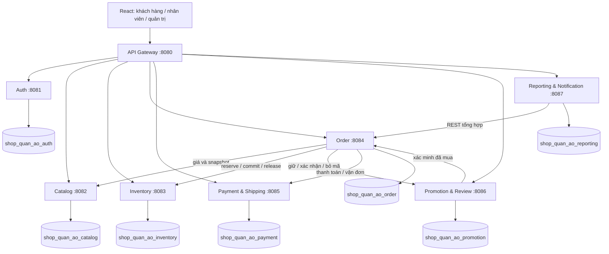
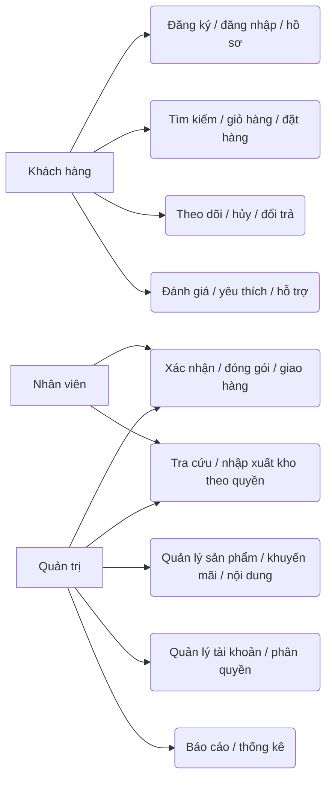
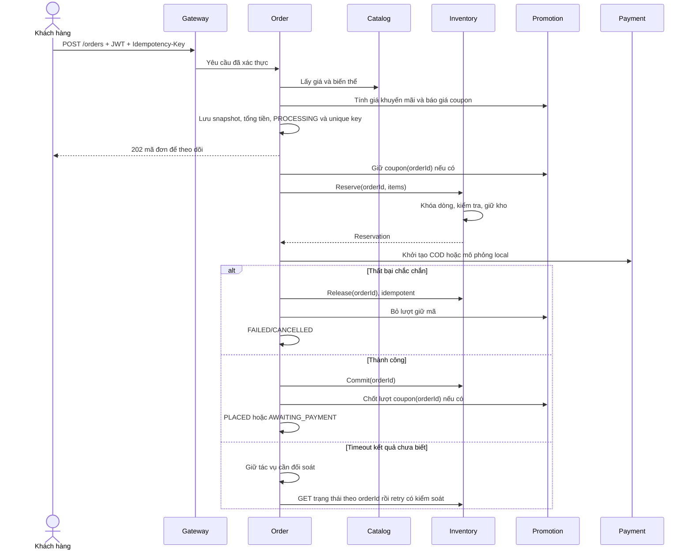
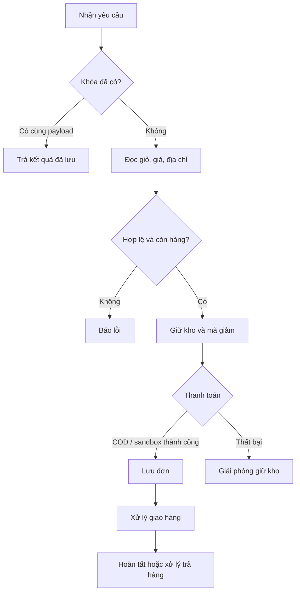
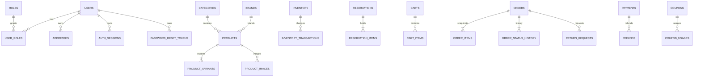
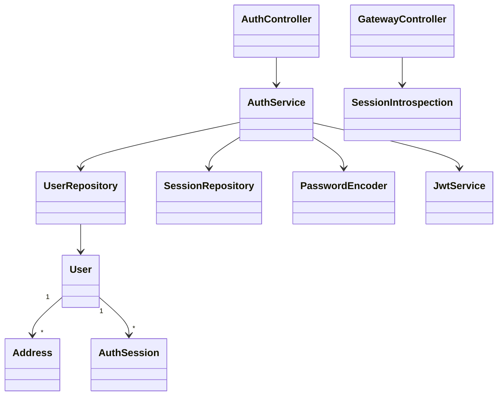

# Sơ đồ thiết kế (Mermaid)

## Kiến trúc và giao tiếp

## Use case tổng quát

## Sequence đặt hàng

## Activity

## ERD theo ranh giới
Các liên kết dưới đây chỉ là FK khi hai bảng cùng service. ID liên service không có FK.

## Class diagram Auth

